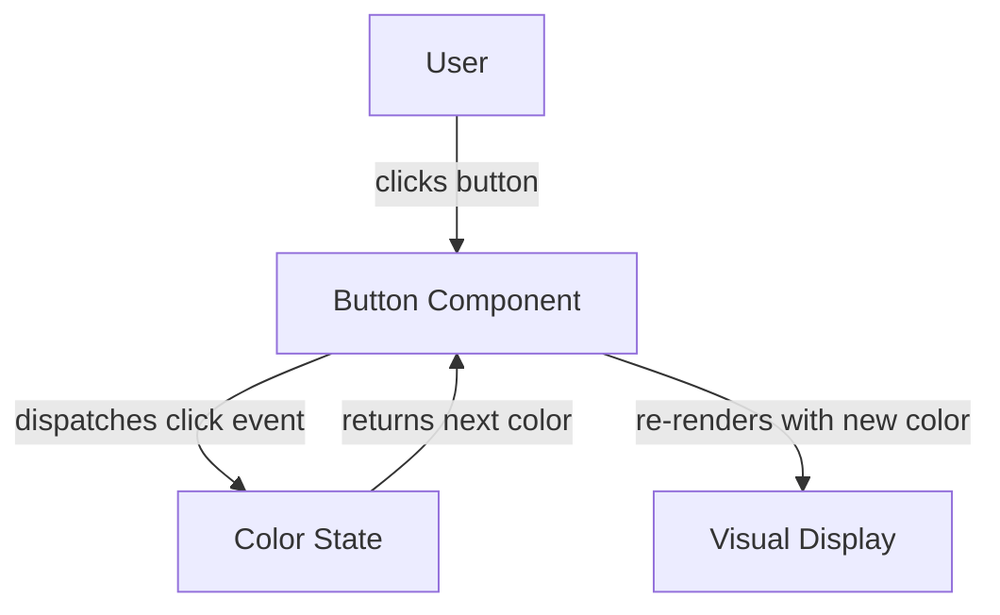

# Design Document: Hello World

## Overview

A minimal interactive module featuring a button that cycles through a set of colors each time it is clicked. The component maintains its current color as local state and updates the display on every click event.

## Architecture



## Components and Interfaces

### Component: ColorButton

**Purpose**: Renders a button whose background color changes on each click.

**Interface**:
```pascal
INTERFACE ColorButton
  colors: Array of String       -- ordered list of color values to cycle through
  currentIndex: Integer         -- index of the currently displayed color
  handleClick(): Void           -- advances currentIndex and updates display
END INTERFACE
```

**Responsibilities**:
- Maintain the current color index in local state
- Cycle to the next color in the list on each click
- Render the button with the current color applied

## Data Models

### Model: ComponentState

```pascal
STRUCTURE ComponentState
  colors: Array of String       -- e.g. ["red", "green", "blue", "yellow"]
  currentIndex: Integer         -- starts at 0, wraps around at end of array
END STRUCTURE
```

**Validation Rules**:
- `colors` must be non-empty
- `currentIndex` must satisfy: 0 ≤ currentIndex < length(colors)

## Key Procedures

```pascal
PROCEDURE handleClick(state)
  INPUT: state of type ComponentState
  OUTPUT: updated state of type ComponentState

  SEQUENCE
    nextIndex ← (state.currentIndex + 1) MOD length(state.colors)
    RETURN ComponentState { colors: state.colors, currentIndex: nextIndex }
  END SEQUENCE
END PROCEDURE

PROCEDURE getCurrentColor(state)
  INPUT: state of type ComponentState
  OUTPUT: color of type String

  SEQUENCE
    RETURN state.colors[state.currentIndex]
  END SEQUENCE
END PROCEDURE
```

## Example Usage

```pascal
SEQUENCE
  -- Initialize component with a set of colors
  state ← ComponentState {
    colors: ["red", "green", "blue", "yellow"],
    currentIndex: 0
  }

  -- User clicks the button
  state ← handleClick(state)
  -- getCurrentColor(state) now returns "green"

  -- User clicks again
  state ← handleClick(state)
  -- getCurrentColor(state) now returns "blue"

  -- Wrap-around: clicking past the last color returns to the first
  state ← ComponentState { colors: ["red", "green"], currentIndex: 1 }
  state ← handleClick(state)
  -- getCurrentColor(state) now returns "red"
END SEQUENCE
```

## Correctness Properties

*A property is a characteristic or behavior that should hold true across all valid executions of a system — essentially, a formal statement about what the system should do. Properties serve as the bridge between human-readable specifications and machine-verifiable correctness guarantees.*

### Property 1: Cycle Round-Trip

*For any* non-empty color list of length N and any starting index, clicking the ColorButton exactly N times returns currentIndex to its original value and displays the original color.

**Validates: Requirements 1.1, 3.2**

### Property 2: Index Always In Bounds

*For any* valid ComponentState and any number of clicks, currentIndex remains in the range [0, length(colors) - 1].

**Validates: Requirements 2.1, 3.1**

### Property 3: Colors Array Immutability

*For any* ComponentState and any number of clicks, the colors array after clicking is identical to the colors array before clicking.

**Validates: Requirements 2.4**

### Property 4: Out-of-Bounds Index Reset

*For any* color list and any currentIndex value that is out of bounds (< 0 or ≥ length(colors)), the ColorButton resets currentIndex to 0 before rendering or cycling.

**Validates: Requirements 5.1**

## Error Handling

### Error Scenario 1: Empty Color List

**Condition**: `colors` array is empty on initialization  
**Response**: Default to a single fallback color (e.g. "gray") and disable cycling  
**Recovery**: Component renders in a stable, non-interactive state

### Error Scenario 2: Invalid Index

**Condition**: `currentIndex` is out of bounds (e.g. after external state corruption)  
**Response**: Reset `currentIndex` to 0  
**Recovery**: Component resumes normal cycling from the first color

## Testing Strategy

### Unit Testing Approach

- Verify initial render shows the first color in the list
- Verify each click advances to the next color in sequence
- Verify wrap-around behavior after the last color

### Property-Based Testing Approach

**Property Test Library**: fast-check

- For any non-empty color list of length N, clicking N times always returns to the starting color
- `currentIndex` is always in range [0, N-1] regardless of click count

### Integration Testing Approach

- Simulate a sequence of user clicks and assert the rendered color matches expected values at each step

## Dependencies

- A UI rendering library or framework (e.g. React, Vue, or plain HTML/JS)
- No external state management required; local component state is sufficient
