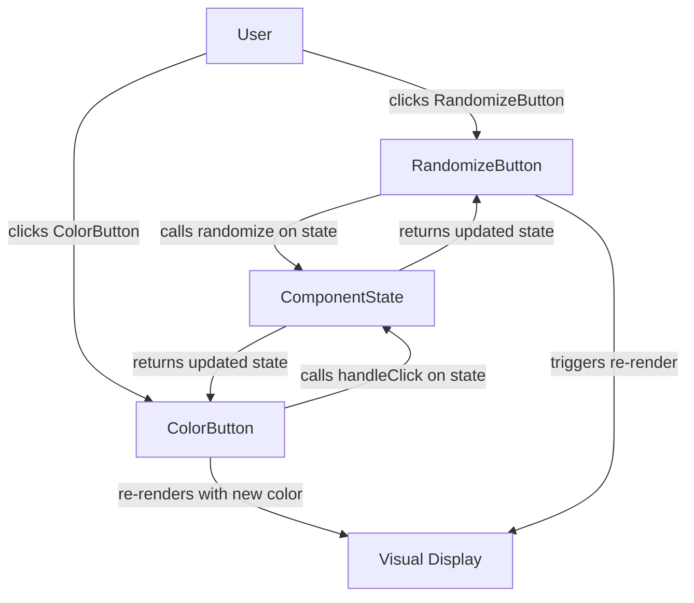

# Design Document: Second Button (RandomizeButton)

## Overview

This feature adds a heart-shaped RandomizeButton alongside the existing ColorButton. When clicked, it picks a random index from the shared ComponentState's color list and updates `currentIndex` to that value. Both buttons read from and write to the same `ComponentState` instance, so the ColorButton immediately reflects the randomized color and continues cycling correctly from the new index onward.

The implementation is entirely in `src/HelloWorld.Web/wwwroot/index.html` (JavaScript + CSS) and `src/HelloWorld.Core/ComponentState.cs` (a new `Randomize` method). No new files or frameworks are required.

## Architecture



Both buttons share a single `state` variable. The RandomizeButton calls `randomize(state)` which returns a new state with `currentIndex` set to a random valid index. The ColorButton continues to call `handleClick(state)` as before.

## Components and Interfaces

### Existing: ColorButton

No changes to ColorButton behavior. It continues to call `handleClick` on the shared state.

### New: RandomizeButton

**Purpose**: Renders a heart-shaped button that, on click, sets `currentIndex` to a uniformly random valid index.

**Interface**:
```pascal
INTERFACE RandomizeButton
  state: ComponentState             -- shared state reference
  handleRandomize(): Void           -- picks random index, updates shared state, re-renders
END INTERFACE
```

**Responsibilities**:
- Render as a heart shape (CSS `clip-path` or inline SVG)
- Be disabled when `state.isInteractive` is false
- On click, call `randomize(state)` and trigger a re-render of both buttons

### Updated: ComponentState (C# + JS mirror)

A `Randomize` method is added to `ComponentState.cs` and its JavaScript mirror in `index.html`.

**C# addition**:
```csharp
/// <summary>
/// Returns a new ComponentState with CurrentIndex set to a uniformly random
/// valid index in [0, Colors.Length - 1]. Colors array is preserved unchanged.
/// </summary>
public ComponentState Randomize(Random rng)
{
    int newIndex = rng.Next(Colors.Length);
    return this with { CurrentIndex = newIndex };
}
```

**JavaScript mirror**:
```javascript
function randomize(state) {
  const newIndex = Math.floor(Math.random() * state.colors.length);
  return { ...state, currentIndex: newIndex };
}
```

## Data Models

No new data models. The existing `ComponentState` structure is extended with the `Randomize` method:

```pascal
STRUCTURE ComponentState
  colors: Array of String       -- ordered list of color values (unchanged)
  currentIndex: Integer         -- 0 ≤ currentIndex < length(colors)
  isInteractive: Boolean        -- false when fallback "gray" is in use
END STRUCTURE

PROCEDURE randomize(state, rng)
  INPUT: state of type ComponentState, rng of type RandomNumberGenerator
  OUTPUT: updated state of type ComponentState

  SEQUENCE
    newIndex ← rng.Next(0, length(state.colors))   -- uniform in [0, N-1]
    RETURN ComponentState { colors: state.colors, currentIndex: newIndex, isInteractive: state.isInteractive }
  END SEQUENCE
END PROCEDURE
```

**Invariants preserved**:
- `colors` array is never mutated
- `currentIndex` is always in `[0, length(colors) - 1]` after `Randomize`
- `isInteractive` is unchanged

## Heart Shape Implementation

The RandomizeButton uses a CSS `clip-path: path(...)` to produce a heart silhouette. This keeps the implementation self-contained in HTML/CSS with no external assets.

```css
#randomize-btn {
  width: 80px;
  height: 80px;
  border: none;
  cursor: pointer;
  background-color: hotpink;
  clip-path: path('M 40,70 C 10,50 0,30 0,20 A 20,20,0,0,1,40,10 A 20,20,0,0,1,80,20 C 80,30 70,50 40,70 Z');
  transition: background-color 0.2s, opacity 0.2s;
}
#randomize-btn:disabled {
  cursor: not-allowed;
  opacity: 0.5;
}
```

The `clip-path: path()` value is supported in all modern browsers (Chrome 88+, Firefox 97+, Safari 13.1+). The heart scales with the element's dimensions since the path coordinates are relative to the element's bounding box via `viewBox`-style path units.

## Correctness Properties

*A property is a characteristic or behavior that should hold true across all valid executions of a system — essentially, a formal statement about what the system should do. Properties serve as the bridge between human-readable specifications and machine-verifiable correctness guarantees.*

### Property 1: Randomize index always in bounds

*For any* non-empty color list of length N, after calling `Randomize`, the resulting `currentIndex` must satisfy `0 ≤ currentIndex < N`.

**Validates: Requirements 2.1, 3.1, 4.2 (edge-case: single color always yields index 0)**

### Property 2: Colors array immutability after randomize

*For any* `ComponentState`, after calling `Randomize`, the `colors` array in the returned state must be reference-equal and value-equal to the original `colors` array.

**Validates: Requirements 2.3**

### Property 3: Cycling continues correctly after randomize

*For any* `ComponentState` after a `Randomize` call that yields index R, calling `HandleClick` k times must produce `currentIndex = (R + k) MOD length(colors)`.

**Validates: Requirements 3.2, 5.1**

### Property 4: Uniform distribution of randomized index

*For any* color list of length N, over a large number of `Randomize` calls (≥ 1000), each index in `[0, N-1]` should appear with frequency approximately `1/N` (within a reasonable statistical tolerance, e.g. chi-squared test at p > 0.01).

**Validates: Requirements 4.1**

### Property 5: Disabled state mirrors non-interactive ComponentState

*For any* `ComponentState` where `isInteractive` is false, the RandomizeButton must be in a disabled state (i.e. clicks have no effect on `currentIndex`).

**Validates: Requirements 1.2**

## Error Handling

### Error Scenario 1: Empty / null color list

**Condition**: `colors` is null or empty when `ComponentState.Create` is called  
**Response**: `ComponentState.Create` already defaults to `["gray"]` with `isInteractive = false`; `Randomize` is never called because the button is disabled  
**Recovery**: Both buttons render in a stable, non-interactive state

### Error Scenario 2: `Randomize` called on non-interactive state

**Condition**: Code calls `Randomize` even when `isInteractive` is false  
**Response**: `Randomize` still returns a valid state (index 0 of `["gray"]`); no exception is thrown  
**Recovery**: No visible change; the button remains disabled in the UI

### Error Scenario 3: `Math.random()` / `Random.Next` edge values

**Condition**: RNG returns 0 or `N-1` (boundary values)  
**Response**: Both are valid indices; no special handling needed  
**Recovery**: Normal render

## Testing Strategy

### Unit Testing Approach

Use xUnit for concrete examples:

- `Randomize` on a single-color list always returns index 0
- `Randomize` returns a state with the same `colors` reference
- `Randomize` followed by `HandleClick` advances index by 1 mod N
- `Randomize` on a non-interactive state returns a valid state without throwing
- RandomizeButton DOM element is present and disabled when `isInteractive` is false

### Property-Based Testing Approach

**Property Test Library**: FsCheck.Xunit (already in `HelloWorld.Tests.csproj`)

Each property test runs a minimum of **100 iterations** (FsCheck default; configure via `[Property(MaxTest = 1000)]` for distribution tests).

| Property | Tag | Min Iterations |
|---|---|---|
| Index always in bounds | `Feature: second-button, Property 1: Randomize index always in bounds` | 100 |
| Colors immutability | `Feature: second-button, Property 2: Colors array immutability after randomize` | 100 |
| Cycling after randomize | `Feature: second-button, Property 3: Cycling continues correctly after randomize` | 100 |
| Uniform distribution | `Feature: second-button, Property 4: Uniform distribution of randomized index` | 1000 |
| Disabled when non-interactive | `Feature: second-button, Property 5: Disabled state mirrors non-interactive ComponentState` | 100 |

Each property-based test must include a comment with the tag above so it can be traced back to this design document.

### Integration Testing Approach

- Render `index.html` in a headless browser (e.g. Playwright) and verify:
  - RandomizeButton is present in the DOM
  - RandomizeButton has the expected `clip-path` CSS property
  - Clicking RandomizeButton changes the ColorButton's background color
  - Clicking ColorButton after RandomizeButton advances color by one step
